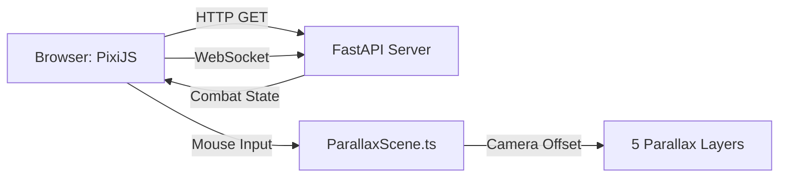

# Project Structure Documentation

## Overview
Faerun Combat is a browser-based side-scroller combat game with aggressive parallax layering, supporting mobile and desktop via web browser.

---

## Technical Specifications

### Screen Resolution
- **Base Canvas Size**: 1920×1080 (Full HD, landscape)
- **Aspect Ratio**: 16:9
- **Rationale**: 
  - Modern mobile devices (2025) support 1080p+ displays as standard
  - Provides ample horizontal space for side-scrolling gameplay
  - Enables rich parallax effects and multiple on-screen entities
  - PixiJS/WebGL handles this resolution efficiently on modern hardware
  - Scales responsively to fit various device viewports while maintaining aspect ratio

---

## Directory Tree

```
faerun-combat/
├── client/                           # Frontend (PixiJS + Vite + TypeScript)
│   ├── src/
│   │   ├── main.ts                  # App entry point, initializes PixiJS
│   │   ├── game/
│   │   │   └── ParallaxScene.ts     # 5-layer parallax rendering system
│   │   ├── sprites/                 # Character/entity classes (future)
│   │   ├── shaders/                 # Custom GLSL shaders (future)
│   │   └── ui/                      # UI components (future)
│   ├── public/
│   │   └── assets/                  # Static assets (sprites, backgrounds)
│   ├── index.html                   # HTML entry point
│   ├── vite.config.ts               # Vite build configuration
│   ├── tsconfig.json                # TypeScript compiler options
│   └── package.json                 # NPM dependencies
│
├── server/                           # Backend (FastAPI + Python)
│   ├── app/
│   │   ├── main.py                  # FastAPI app entry, CORS setup
│   │   ├── routers/
│   │   │   ├── combat.py            # Combat endpoints + WebSocket
│   │   │   └── saves.py             # Save/load game endpoints
│   │   ├── services/                # Business logic (future)
│   │   ├── models/                  # Pydantic schemas (future)
│   │   └── db/                      # Database setup (future)
│   └── requirements.txt             # Python dependencies
│
└── README.md                         # Quick start guide
```

---

## File Responsibilities

### Frontend

| File | Purpose | Key Contents |
|------|---------|--------------|
| `main.ts` | App bootstrap | PixiJS initialization, game loop |
| `ParallaxScene.ts` | Parallax engine | 5 layers (skybox → foreground), mouse camera control |
| `index.html` | HTML shell | Canvas container, module script loader |
| `vite.config.ts` | Build config | Dev server settings, port 5173 |
| `tsconfig.json` | TypeScript config | Compiler options, module resolution |
| `package.json` | NPM config | Dependencies (pixi.js, vite, typescript) |

### Backend

| File | Purpose | Key Contents |
|------|---------|--------------|
| `main.py` | API entry | FastAPI app, CORS middleware, router registration |
| `combat.py` | Combat logic | REST endpoints, WebSocket handler, in-memory state |
| `saves.py` | Save system | CRUD endpoints for game saves |
| `requirements.txt` | Python deps | fastapi, uvicorn, websockets |

---

## Data Flow



---

## Adding New Features

### New Frontend Component
1. Create file in `client/src/[category]/ComponentName.ts`
2. Add header comment with path and purpose
3. Import and use in `main.ts` or `ParallaxScene.ts`

### New Backend Endpoint
1. Create router in `server/app/routers/feature.py`
2. Add header comment with path and purpose
3. Register in `main.py` via `app.include_router()`

---

## Header Comment Convention

Every file should start with:
```typescript
/**
 * Path: [relative path from project root]
 * Purpose: [one-line description]
 * Logic:
 *   - [key responsibility 1]
 *   - [key responsibility 2]
 */
```

Example:
```typescript
/**
 * Path: client/src/game/ParallaxScene.ts
 * Purpose: Manages 5-layer parallax scene with mouse-controlled camera
 * Logic:
 *   - Creates 5 depth layers (skybox, background, midground, stage, foreground)
 *   - Tracks mouse position to smoothly pan camera
 *   - Applies per-layer motion scale for parallax effect
 */
```

---

## Quick Commands

```powershell
# Run frontend
cd D:\Code\Faerun\faerun-combat\client && npm run dev

# Run backend
cd D:\Code\Faerun\faerun-combat\server && uvicorn app.main:app --reload
```
